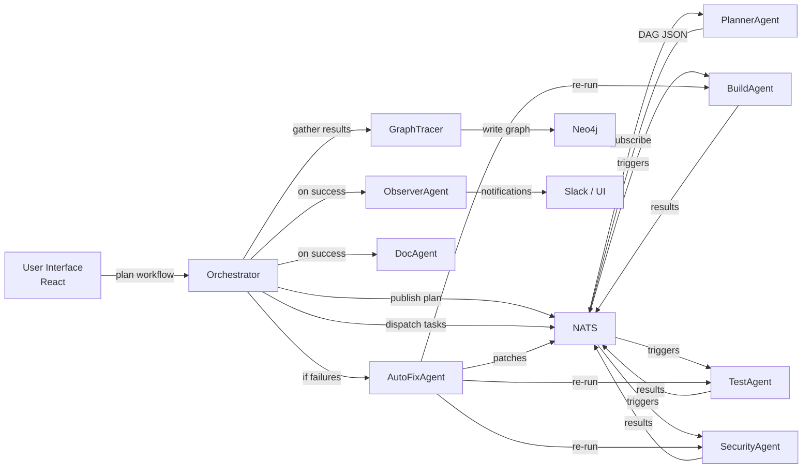

# Granite Copilot for Workflow – Architecture Overview

This document describes the high-level architecture of Granite Copilot for Workflow, a self-correcting, neuro-symbolic automation platform that turns user intent into fully verified workflows. It covers core components, interactions, data flow, and deployment topology.

---

## 1. Conceptual Layers

1. **User Interface (Frontend)**  
   - **ChatWindow**: Conversational entry point for natural-language prompts.  
   - **WorkflowDesigner**: YAML editor + visual DAG builder.  
   - **LogsViewer**: Real-time log stream with filtering.

2. **Orchestration & Brain**  
   - **Orchestrator**: FastAPI service that manages lifecycle: Plan → Execute → Verify → Correct.  
   - **LLM Connector**: Wraps IBM Granite / watsonx function calls for planning & auto-fix prompts.  
   - **Graph Tracer**: Persists run, task, agent, and verdict metadata into Neo4j.

3. **Agent Mesh**  
   - **PlannerAgent**: Converts intent or YAML into task DAG.  
   - **BuildAgent**: Runs `docker build` / git checkout.  
   - **TestAgent**: Executes unit/integration tests.  
   - **SecurityAgent**: Performs SCA/SAST scans.  
   - **ComplianceAgent**: Enforces policy-as-code (OPA).  
   - **DocAgent**: Generates release notes or documentation via LLM.  
   - **AutoFixAgent**: Patches failures by prompting Granite for code/docs fixes.  
   - **ObserverAgent**: Streams metrics, posts Slack notifications.

4. **Symbolic & Verification Layer**  
   - **Rule Engine (IBM ODM)**: Business-rule evaluation for compliance tasks.  
   - **OWL Reasoner**: Ontology-based checks (e.g., corporate term consistency).

5. **Infrastructure & Data Services**  
   - **NATS**: Event bus for inter-agent RPC (publish/subscribe).  
   - **Neo4j**: Graph database for audit trail and provenance.  
   - **MinIO**: Artifact storage for DAG definitions and logs.  
   - **PostgreSQL (optional)**: Persistence for orchestrator configuration and user sessions.

---

## 2. Data & Control Flow

